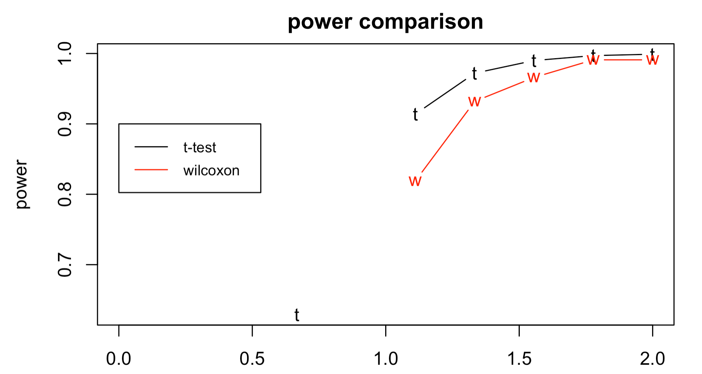

## PSTAT220A

### Homework 2: Due 10/20/21

```{r setup, include=FALSE, warning = FALSE, error = FALSE, message=FALSE}
knitr::opts_chunk$set(echo = FALSE)
```

#### Question 1
paired t-test, singed rank test, two sample t-test (equal variances or unequal variances), Wilcoxon rank test, other

*A) ANSWER*: Because the researcher expected twinship to eliminate external differences to hemoglobin, a *paired t-test* would be conducted (although I personally think twins are too different to compare metabolisms).

+ H0 (null hypothesis): There is no difference in the mean hemogloblin levels between honey and non-honey drinker in twin groups (the difference in the mean = 0).

+ HA (alternative hypothesis): There is a difference in the mean hemogloblin levels between honey and non-honey drinker in twin groups.

In conclusion, *there is a significant difference* in the mean hemogloblin levels between honey and non-honey drinker in twin groups. The *p value is 0.005218*, which is < 0.05 and means we can reject our H0. Also, because our 95% CI (4.028033 - 13.638633) does not include 0, then we know the mean difference between the pair is not equal to 0, it is 8.83.

```{r}
## upload data
honey <- c(19,12,9,17,24,24)
no_honey <- c(14,8,4,4,11,11)
pair <- c(1:6)
group <- cbind(honey, no_honey)

## visualize data

# check distribution
#hist(honey)
#hist(no_honey)

# check outliers
boxplot(group)

plot(honey, ylim = c(0,30), xlab = "pair", ylab = "hemoglobin")
points(no_honey, col = "red")
legend(.9,30, legend = c("honey", "no honey"),
       col = c("black", "red"), pch = 1, cex = .8)


## run paired t-test
t.test(honey, no_honey, paired = T)

# p-value = 0.005218
# CI does not fall between 0 (4.028033 - 13.638633)

# conclusion, there is a difference in hemoglobin levels between honey and no honey drinkers


## check variances
# H0: variance of groups are equal
# p < 0.05 --> accept null 
var.test(honey, no_honey) # p-value = 0.3883

# Variances of honey and honey are unequal 

```

B) ANSWER: I would run a *paired t-test* because we are comparing the difference of premature beats in the same patient. 

+ H0 (null hypothesis): There is no difference in the mean number of premature beats per minutes between the before and after groups (the difference in the mean = 0).

+ HA (alternative hypothesis): There is a difference in the mean number of premature beats per minutes between the before and after groups.

In conclusion, *there is a significant difference* in the mean number of premature beats per minutes between the before and after groups. The *p value is 0.01763*, which is < 0.05 and means we can reject our H0. Also, because our 95% CI (2.423084 20.576916) does not include 0, then we know the mean difference between the pair is not equal to 0, it is 11.5.

```{r}
## upload data
before <- c(6,9,17,22,7,5,5,14,9,7,9,51)
after <- c(5,2,0,0,2,1,0,0,0,0,13,0)
dif <- c(1,7,17,22,5,4,5,14,9,7,-4,51)
patient <- c(1:12)

patients <- cbind(before, after)

## visualize data

# check distribution
#hist(before)
#hist(after)

# check outliers
boxplot(patients)

t.test(before, after, paired = T)
# p-value = 0.01763
# 2.423084 - 20.576916
```

D) ANSWER: I would run a *two Sample t-test (equal variance)* because we are comparing the mean between two groups (oxygen vs placebo gel). The distribution of both groups is trending normal, although there are two outliers in the placebo group which skews it a bit. And the variances are equal (p = 0.2261).

+ H0 (null hypothesis): There is no difference in the mean oral hygiene index between the oxygen gel and placebo gel. (mu_oxygen = mu_placebo)

+ HA (alternative hypothesis): There is a difference in the mean oral hygiene index between the oxygen gel and placebo gel.

In conclusion, *there is a significant difference* in the mean oral hygiene index between the oxygen gel and placebo gel. The *p value is 0.001077*, which is < 0.05 and means we can reject our H0. Also, because our 95% CI (1.519477 - 5.762876) does not include 0, then we know the mean of both groups are not equal to 0. The mean oral index for oxygen gel and placebo gel, is 8.20 and 4.56, respectively. 

```{r}
## upload data
oxygen <- c(10,15,6,10,11,4,10,15,11,5,3,8,8,3,13,14,7,8,8,2,10,9,8,9,8,13,6,2,7,3)

placebo <- c(5,6,4,3,3,2,3,6,0,3,3,3,13,4,5,6,4,4,2,-3,1,6,6,8,0,7,0,3,2,2,12,24,5,3)

gel <- cbind(oxygen, placebo)

## visualize data

# check distribution
hist(oxygen)
hist(placebo)

# check outliers
boxplot(gel)

## paired t-test

t.test(oxygen, placebo)
# p-value = 0.0009321
# 95 CI = 1.548450 - 5.733903
# mu_oxygen = 8.20
# mu_placebo = 4.56


## test variance

var.test(oxygen, placebo)
# p-value = 0.2261
# 95 CI =  0.3146534 - 1.3247171
# variances are equal

t.test(oxygen, placebo, var.eq = T)
# p-value = 0.001077
# 95 CI = 1.519477 - 5.762876
```

E) ANSWER: I would run a *Wilcoxon rank sum test* because we are comparing the mean between two groups (potassium vs electrolytic oxygen) but their distributions are not normal with some outliers. 

+ H0 (null hypothesis): The true location shift is equal to 0 (median) for the potassium vs electrolytic oxygen groups. (M_d = 0)

+ HA (alternative hypothesis): The true location shift is not equal to 0 (median) for the potassium vs electrolytic oxygen groups. (M_d /= 0)

In conclusion, *there is no significant difference* in the median between the potassium vs electrolytic oxygen groups. The *p value is 0.6961*, which is > 0.05 and means we fail to reject our H0. 

```{r}

## upload data
potassium <- c(1.42920, 1.42860, 1.42906, 1.42957, 1.42910, 1.42930, 1.42945)

electrolytic <- c(1.42932, 1.42908, 1.42910, 1.42951, 1.42933, 1.42905, 1.42914, 1.42849, 1.4294, 1.42886)

group <- cbind(potassium, electrolytic)
## visualize data

# check distribution
library(car)
qqPlot(group)

# check outliers
boxplot(group)

# compute wilcoxon signed rank test
wilcox.test(potassium, electrolytic)
# W = 39.5
# p-value = 0.6961

```

F) ANSWER: I would run a *two Sample t-test (unequal variance)* because we are comparing the mean between two groups (chemical vs air). The distribution of both groups are trending normal, although there are two slight outliers. And the variances are un-equal (p = 4.234e-06).

+ H0 (null hypothesis): There is no difference in the mean density of nitrogen between the chemical compounds and air groups. (mu_chemical = mu_air)

+ HA (alternative hypothesis): There is a difference in the mean density of nitrogen between the chemical compounds and air groups.

In conclusion, *there is a significant difference* in the mean density of nitrogen between the chemical compounds and air groups. The *p value is 8.594e-08*, which is < 0.05 and means we can reject our H0. Also, because our 95% CI (-0.01180801 - -0.00949949) does not include 0, then we know the mean of both groups are not equal to 0. The mean oral index for chemical compounds and air, are 2.29 and 2.31, respectively. 

```{r}
## upload data
chemical <- c(2.30143, 2.29890, 2.29816, 2.30182, 2.29869, 2.29940, 2.29849, 2.29889)

air <- c(2.31026, 2.31017, 2.30986, 2.31003, 2.31007, 2.31024, 2.31010, 2.31028)

group <- cbind(chemical, air)

## visualize data

# check distribution
library(car)
qqPlot(group)

# check outliers
boxplot(group)

## test variance

var.test(chemical, air)
# p-value = 4.234e-06
# 95 CI =  18.98847 473.74564
# variances are NOT equal

t.test(chemical, air, var.eq = F)
# p-value = 8.594e-08
# 95 CI = -0.01180801 -0.00949949
# mu_chemical = 2.29
# mu_air = 2.31
```

G) ANSWER: I would run a *two Sample t-test (equal variance)* because we are comparing the mean between two groups (music vs no music). The distribution of both groups is trending normal. And the variances are equal (p = 0.3048).

+ H0 (null hypothesis): There is no difference in the mean productivity between the music and non music groups. (mu_music = mu_nomusic)

+ HA (alternative hypothesis): There is a difference in the mean productivity between the music and non music groups.

In conclusion, *there is not a significant difference* in the mean oral hygiene index between the oxygen gel and placebo gel. The *p value is 0.1417*, which is > 0.05 and means we fail to reject our H0. Also, because our 95% CI (-5.175961 33.042627) does include 0. The mean oral index for oxygen gel and placebo gel, is 59.2 and 49.2, respectively. 
```{r}
## upload data
music <- c(35, 36.8, 40.2, 46.6, 50.4, 64.2, 83, 87.6, 89.2)
no_music <- c(28.2, 28.6, 33, 34.8, 45.4, 50.8, 52.6, 66.4, 67.8)

group <- cbind(music, no_music)

## visualize data

# check distribution
library(car)
qqPlot(music)
qqPlot(no_music)

# check outliers
boxplot(group)

## test variance

var.test(music, no_music)
# p-value = 0.3048
# 95 CI =  0.4809515 - 9.4525212
# variances are equal

t.test(music, no_music, var.eq = T)
# p-value = 0.1417
# 95 CI = -5.175961 33.042627
# mu_music = 59.22222
# mu_nomusic = 45.28889
```

H) ANSWER: I would run a *Wilcoxon rank sum test* because we are comparing the mean between two groups (male vs female) but their distributions are not normal with some outliers. 

+ H0 (null hypothesis): The true location shift is equal to 0 (median) for the male vs females groups. (M_d = 0)

+ HA (alternative hypothesis): The true location shift is not equal to 0 (median) for the male vs females groups. (M_d /= 0)

In conclusion, *there is no significant difference* in the median between the potassium vs electrolytic oxygen groups. The *p value is 0.5287*, which is > 0.05 and means we fail to reject our H0. 
```{r}
## upload data

males <- c(40, 76, 89, 106, 120, 130, 150, 155, 382)
females <- c(66,69, 94, 103, 117, 391)

group <- cbind(males, females)

## visualize data

# check distribution
library(car)
qqPlot(group)

# check outliers
boxplot(group)

wilcox.test(males, females)
# p-value = 0.5287
# W = 33
```

I) ANSWER: I will use a two-sample t-test since I generated/simulated two populations (high and low) with a normal distribution. 

+ H0 (null hypothesis): The mean lifetime of the population of high activity flies is equal to the mean lifetime of the population of low flies. (mu_high = mu_low)

+ HA (alternative hypothesis): The mean lifetime of the population of high activity flies is not equal to the mean lifetime of the population of low flies

In conclusion, with a *p-value = < 2.2e-16* (p < 0.05) I can *reject the null hypothesis* which means the mean lifetime of high activity and low activity flies are significantly different. The *95 CI  (-33.69829 - -25.68222)* does not contain 0 which also validates this statement. The mean lifetime of high and low acitivity flies are *20.9* and *50.6*, respectively. 
```{r}
## upload data

# generate populations
high <- rnorm(200, 20.6, 6)
low <- rnorm(47,48.1, 14.2)

plot(high, ylim = c(0,100))
points(low, col = "red")
legend(150, 100, legend = c("high","low"),
       col = c("black", "red"), pch = 1, cex = .8)

# run two-sample t-test

t.test(high, low)
# p-value < 2.2e-16
# -33.69829 - -25.68222
# high mean = 20.98665
# low mean = 50.67690

```

J) ANSWER: I will use a two-sample t-test since I generated/simulated two populations (temp and control) with a normal distribution. 

+ H0 (null hypothesis): The mean lifetime of the population of temperature flies is equal to the mean lifetime of the population of control flies. (mu_temp = mu_control)

+ HA (alternative hypothesis): The mean lifetime of the population of temperature flies is not equal to the mean lifetime of the population of control flies.

In conclusion, with a *p-value = < 2.2e-16* (p < 0.05) I can *reject the null hypothesis* which means the mean lifetime of temperature and control flies are significantly different. The *95 CI  (6.466135 - 9.220216)* does not contain 0 which also validates this statement. The mean lifetime of temperature and control flies are *25.4* and *17.6*, respectively. 

```{r}
## upload data

# generate populations
temp <- rnorm(200, 25.9, 8)
control <- rnorm(200, 17.6, 6)

plot(temp, ylim = c(0,60))
points(control, col = "red")
legend(1, 60, legend = c("temp","control"),
       col = c("black", "red"), pch = 1, cex = .4)

# run two-sample t-test

t.test(temp, control)
# p-value < 2.2e-16
# 95 CI: 6.466135 - 9.220216
# temp mean =  25.49730
# control mean = 17.65413 


```

#### Question 2

ANSWER: If I had to apply one of the above simple tests from question 1, I would conduct a *two sample t-test* given normal distribution and equal variance because you are comparing the mean cortex weight between two groups - the treatment and control. However a two sample t-test would not include the factor, experiment number, and because the experiementers wanted to repeat their experiments to test an effect of toys on cortex weight, a two sample t-test would be insufficient. 

I think a more reasonable test to conduct would be a *linear regression model* with the dependent variable (Y = cortex weight) and independent variables (X1 = toy allowance and X1 = experiment #) to test the association between toys and cortex development. The variable toy allowance would be a factor with two levels - given toys (treatment) or not given toys (control). However other variables, or confounders, in this study could be individual rat weight, overall rat health, etc.


#### Question 3

ANSWER: The permutation test was ran with the below hypotheses and the results are summarized with a histogram. 

+ H0 (null hypothesis): The amount of hemogloblin associated with honey group is equal to amount of hemogloblin associated with non honey group (mu_difference = 0)

+ HA (alternative hypothesis): The amount of hemogloblin associated with honey group is not equal to amount of hemogloblin associated with non honey group.

The *bootstrap confidence intervals* for the difference of population means are 95% CI: *5 - 13*. 

```{r}

library(coin)

## upload data
honey <- c(19,12,9,17,24,24)
no_honey <- c(14,8,4,4,11,11)

## run permuation test

d <- honey - no_honey # difference between honey and no honey
n <- length(d) # create vector of length of d

d.perm <- matrix(abs(d), n, 1000) # create empty matrix
d.perm <- d.perm*sign(runif(1000*n) - .5) # fill in matrix
d.bar <- apply(d.perm, 2, mean) 
hist(d.bar, freq = F, main = "permutation histogram")
abline(v = mean(d), col = "red")

mean(abs(d.bar) > abs(mean(d)))

## construct bootstrap confidence intervals for the difference of population means

d <- honey - no_honey # difference between honey and no honey
boot.smpl <- matrix(d, length(d), 1000) # create matrix
boot.smpl <- apply(boot.smpl, 2, sample, r = T) # replace = true
boot.md <- apply(boot.smpl, 2, median)

var(boot.md) # 11.19549

quantile(boot.md, c(.25, .975)) # create 95% CI 
# CI: 5 - 13

hist(boot.md, freq = F, main = "bootstrap histogram") # histogram of bootstrap estimates
abline(v = c(5, 13), col = "red")


```


#### Question 4

ANSWER: The permutation test was ran with the below hypotheses and the results are summarized with a histogram. 

+ H0 (null hypothesis): The amount of oral hygiene index associated with oxygen group is equal to amount of oral hygiene index associated with placebo group (mu_difference = 0).

+ HA (alternative hypothesis): The amount of oral hygiene index associated with oxygen group is not equal to amount of oral hygiene index associated with placebo group

The *bootstrap confidence intervals* for the difference of population means are 95% CI: *3.5 - 6*. 

```{r}

## upload data
oxygen <- c(10,15,6,10,11,4,10,15,11,5,3,8,8,3,13,14,7,8,8,2,10,9,8,9,8,13,6,2,7,3)

placebo <- c(5,6,4,3,3,2,3,6,0,3,3,3,13,4,5,6,4,4,2,-3,1,6,6,8,0,7,0,3,2,2,12,24,5,3)

## run permuation test

d <- oxygen - placebo # difference between oxygen and placebo
n <- length(d) # create vector of length of d

d.perm <- matrix(abs(d), n, 1000) # create empty matrix
d.perm <- d.perm*sign(runif(1000*n) - .5) # fill in matrix
d.bar <- apply(d.perm, 2, mean) 
hist(d.bar, freq = F, main = "permutation histogram")
abline(v = mean(d), col = "red")

mean(abs(d.bar) > abs(mean(d)))

## construct bootstrap confidence intervals for the difference of population means

d <- oxygen - placebo # difference between oxygen and placebo
boot.smpl <- matrix(d, length(d), 1000) # create matrix
boot.smpl <- apply(boot.smpl, 2, sample, r = T) # replace = true
boot.md <- apply(boot.smpl, 2, median)

var(boot.md) # 1.392837

quantile(boot.md, c(.25, .975)) # create 95% CI 
# CI: 3.5 - 6

hist(boot.md, freq = F, main = "bootstrap histogram") # histogram of bootstrap estimates
abline(v = c(4, 6), col = "red")


```


#### Question 5

ANSWER: The **t-test** is used to compare *means*, whereas the **wilcoxon's** test the *ordering* of the data. The **t-test** is a *parametric* test whereas the **wilcoxon's** is a *non-parametric* test, meaning the **t-test** follows *more assumptions* than the wilcoxon's (i.e. t-test assumptions assumes normal distribution and equal variance). Because the **t-test** is the parametric version and follows strict assumptions it is more conservative and a stronger test to perform for significance when comparing two groups. With my gaussian distribution, simulations we can see that the t-test (black line) has a higher power than the wilcoxon test (red line), although the lines were very close. However, with my non-gaussian distribution (poisson), there is a larger difference between t-test and wilcoxon with the t-test having higher power than wilcoxon. 

*note: I try running the simulation for rpois but the output was 20+ pages long, so I inserted the photo of the simulation to reduce the number of pages in my knitted document


```{r}
# gaussian distribution
n <- 10
nsim <- 1000
d <- seq(0,2, len = 10)

pt <- pw <- matrix(NA, 10, nsim)
for(j in 1:10) {
  for(i in 1:nsim) {
    y <- rnorm(n, mean = d[j], sd = 1)
    pt[j,i] <- t.test(y)$p.value
    pw[j,i] <- wilcox.test(y)$p.value
  }
}

powert <- apply(pt<.05,1,mean)
powerw <- apply(pw<.05,1,mean)

print(rbind(powert, powerw))

plot(d, powert, type = "b", pch = "t", xlab = "d", ylab = "power", main = "power comparison w/ gaussian")
points(d, powerw, type = "b", pch = "w", col = "red")
legend(0, .9, legend = c("t-test", "wilcoxon"), 
       col = c("black", "red"), lty = 1:1, cex = .8)


# n <- 10
# nsim <- 500
# d <- seq(0,2, len = 10)
# 
# pt <- pw <- matrix(NA, 10, nsim)
# for(j in 1:10) {
#   for(i in 1:nsim) {
#     y <- rpois(n, lambda = d[j])
#     pt[j,i] <- t.test(y)$p.value
#     pw[j,i] <- wilcox.test(y)$p.value
#   }
# }
# 
# ?rpois
# powert <- apply(pt<.05,1,mean)
# powerw <- apply(pw<.05,1,mean)
# 
# print(rbind(powert, powerw))
# 
# plot(d, powert, type = "b", pch = "t", xlab = "d", ylab = "power", main = "power comparison w/ poisson")
# points(d, powerw, type = "b", pch = "w", col = "red")
# legend(0, .9, legend = c("t-test", "wilcoxon"), 
#        col = c("black", "red"), lty = 1:1, cex = .8)
```


#### Question 6

ANSWER: To compare two proportions of recieving dealth penalty from two independent groups (white and black), we will conduct a 2-sample test for equality of proportions with continuity correction.

+ H0 (null hypothesis): The proportion of white population is equal to proportion of black population that would receive the death penalty (p_white = p_black).

+ HA (alternative hypothesis): The proportion of white population is not equal to proportion of black population that would receive the death penalty.

In conclusion, with a *p-value = 0.7689* (p > 0.05), we fail to reject our null hypothesis meaning the proportion of white pop. *is equal* to the proportion of black pop. that receives the death penalty with a *95 CI of -0.05791211 - 0.09059283*. The *estimates of proportion for white and black populations is 0.1187500 and 0.1024096*, respectively. The Pearson's chi-squared test statistic is *X-squared = 0.086343*.

```{r}

## upload data

# 19/160 white defendents death penalty
# 17/166 black defendants death penalty

# compare two proportions

x = c(19,17) # x = vector of counts as success
n = c(160, 166) # n = vector of count trials
alternative = "two.sided"
# alternative = character string specifying the alternative hypothesis, could also put one.sided
conf.level = 0.95 # confidence level

## R function for Z test
prop.test(x = x,  # success
          n = n,  # number of trials
          alternative = alternative, 
          conf.level = conf.level)


# X-squared = 0.086343 which is the Pearson's chi-squared test statisitic
# p-value = 0.7689
# prop 1 (white) estimate = 0.1187500
# prop 2 (black) estimate = 0.1024096

```


#### Question 7

ANSWER: To test of goodness of fit establishes whether or not an observed frequency distribution differs from a theoretical distribution. I have written a chi-square test for given probabilities for two scenarios: tomatoes and birth hour. 

For **tomatoes**, 

+ H0 (null hypothesis): The observed frequency of tomato phenologies is the same as a theoretical distribution 

+ HA (alternative hypothesis): The observed frequency of tomato phenologies is not the same as a theoretical distribution 

In conclusion, my **p-value = 0.6895** (p > 0.05), so we fail to reject the null hypothesis which means tomoato phenologies are the same as the theoretical distribution. AKA, the **tomato data is consistent with Mendel's law**.

For **birth hour**,

+ H0 (null hypothesis): The observed frequency of birth hour is the same as a theoretical distribution 

+ HA (alternative hypothesis): The observed frequency of birth hour is not the same as a theoretical distribution 

In conclusion, my **p-value = < 2.2e-16** (p < 0.05), so we reject the null hypothesis which means birth hours are not the same as the theoretical distribution. AKA, the **birth hour data is not consistent throughout the night** and is more likely to commence very late at night.

```{r}
# write a function for goodness of fit tests with category probabilities


## for tomato example

x = c(926, 288, 293, 104) # vector of tomato phenotypes
chisq.test(x = x,
           p = c(9,3,3,1)/16)
# p-value = 0.6895
# X-squared = 1.4687

## for birth hour example
length(x)
x = c(52,73,89,88,68,47,58,47,48,53,47,34,21,31,40,24,37,31,47,34,36,44,78,59) # vector of birth hours
chisq.test(x = x,
           p = rep(1,24)/24)
# p-value = < 2.2e-16
# X-squared = 162.78


```


#### Question 8

ANSWER: I will use a *contingency table* to answer questions regarding the independence of both political views and marijuana usage. To test for independency I will test that an individual's category with respect to variable (political party) is independent of the category with respect to variable (marijuana usage).

+ H0 (null hypothesis): In terms of the number of times individuals used marijuana, the effect of usage level is independent of the effect of political views. (p_ij = p_i + p + j, where j = usage level and i = political party).

+ HA (alternative hypothesis): In terms of the number of times individuals used marijuana, the effect of usage level is not independent of the effect of political views.

In conclusion, our p-value from a pearson's chi-square test is *p = 3.043e-13* (p < 0.05), meaning we reject our null hypothesis and can say signficantly that political party and marijuana usage level *are not two independent variables*.

```{r}
## upload data

ma <- matrix(c(479, 173, 119, 214,47,15,172,45,85),3,3 )


## visualize data

liberal <- c(479, 173, 119)
conservative <- c(214,47,15)
other <- c(172,45,85)

group <- c(liberal, conservative, other)

names(group) <- c("liberal", "conservative", "other")


plot(liberal, ylim = c(0, 500), main = "marijuana usage by political party", ylab = "# of uses", col = "blue")
points(conservative, col = "red")
points(other, col = "green")
legend(2.5,500, legend = c("liberal", "conservative", "other"),
       col = c("blue", "red", "green"), pch = 1, cex = .8)


# check distribution
hist(ma)


## chi square test

chisq.test(ma)
# p-value = 3.043e-13
# X-squared = 64.654


# p < 0.05, can reject null hypothesis 
```

#### Question 9

ANSWER: To get inference on a proportion, I will use an *exact binomial test* where *success is defined by finding a defective battery (n = 124)* and failure (n = 26) is defined by finding a non-defective battery in a random sample of 150 flashlights. 

+ H0 (null hypothesis):  the true probability of success (selecting defective battery) is equal to .75

+ HA (alternative hypothesis): the true probability of success (selecting defective battery) is not equal to .75

In conclusion, with a *p-value < 2.2e-16* (p < 0.05) we can reject the null hypothesis and state that the true probability of selecting a defective battery (success) is not equal to .75 and the true probability of selecting a defective battery is *0.4525547* with the 95% CI  0.3925903-0.5135564.

```{r}
## upload data

freq <- c(26,51,47,16,10)


success <- 51+47+16+10 # defined for number of defective 1,2,3,4
failure <- 26 # defined for number of defective = 0
total <- success + failure # 150 total

# conduct binomial test with probability of success equal to 3/4
binom.test(c(success, total), p = 3/4)


```

#### Question 10

ANSWER: The populations (present/absent) and each population is divided into the same categories of insulin dose (<.25, .25-.49, .50-.74, .75-99, >=1). I will run a two-way tables to calculate the pearson's chi-squared test.

+ H0 (null hypothesis): the proportion of individuals who belong to different categories of insulin dose is the same as individuals part of present and absent variables. 

+ HA (alternative hypothesis): the proportion of individuals who belong to different categories of insulin dose is not the same as individuals part of present and absent variables.

In conclusion, with a **p-value = 0.01182** (p < 0.05) we reject the null hypothesis and state that the presence/absence of **hypoglycemia is not independent of insulin dosage**. 

```{r}

## upload data

x <- matrix(c(4,40,21,74,29,59,15,26,12,46),2,5)

# run chi square test
chisq.test(x)
# p-value = 0.01182
# X-squared = 12.892

```


